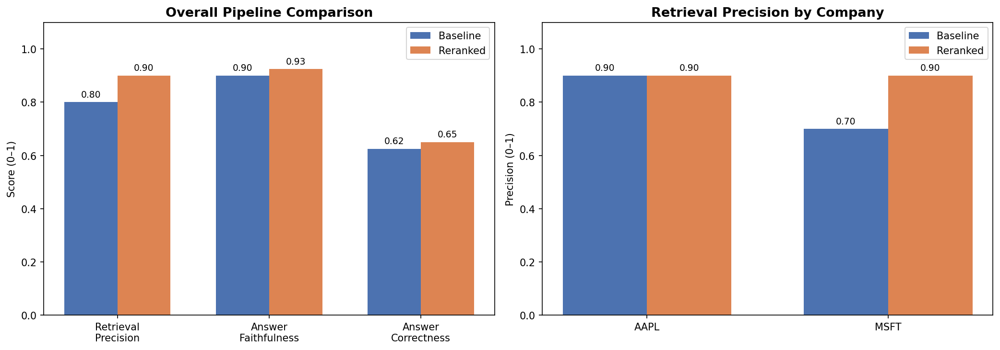

# RAG Eval Framework for Financial Document Q&A

A systematic evaluation framework measuring retrieval quality and answer 
accuracy across a multi-document corpus of Apple and Microsoft 10-K SEC filings.
Built as a follow-on to [RAG_10K_Assistant](../rag-10k-assistant) — moving from 
eyeballing outputs to measuring them.

## Why This Exists

Building a RAG pipeline is straightforward. Knowing whether it actually works 
is harder. This framework replaces subjective output review with reproducible 
metrics — the difference between an AI demo and a shippable AI product.

## What It Measures

| Metric | Description |
|---|---|
| **Retrieval Precision** | Did the right chunk get retrieved? |
| **Answer Faithfulness** | Is the answer grounded in retrieved context? |
| **Answer Correctness** | Does the answer match ground truth? |

## Architecture

1. **Corpus** — Apple + Microsoft 10-K filings pulled from SEC EDGAR
2. **Indexing** — OpenAI `text-embedding-3-small` (1536 dims) + FAISS IndexFlatL2
3. **Test Set** — 20 synthetic Q&A pairs generated from source chunks via GPT-4o-mini
4. **Pipelines** — Baseline (FAISS top-3) vs. Reranked (FAISS top-10 → Cohere cross-encoder → top-3)
5. **Scoring** — LLM-as-judge evaluation on all three metrics

## Results

| Metric | Baseline | Reranked |
|---|---|---|
| Retrieval Precision | 0.80 | 0.90 |
| Answer Faithfulness | 0.90 | 0.93 |
| Answer Correctness | 0.62 | 0.65 |

**Key finding:** Reranking had the largest impact on Microsoft chunks specifically 
— retrieval precision jumped from 0.70 to 0.90. When two companies share 
overlapping topics (cloud, AI investment, services revenue), the Cohere 
cross-encoder correctly disambiguates where FAISS alone cannot.

Answer correctness lagging behind retrieval precision (0.65 vs 0.90) points to 
a chunking problem — the right section is being retrieved but answers are 
split across chunk boundaries.

## Stack

- **Embeddings** — OpenAI `text-embedding-3-small`
- **Vector Search** — FAISS `IndexFlatL2`
- **Reranking** — Cohere `rerank-english-v3.0`
- **Generation + Scoring** — GPT-4o-mini
- **Environment** — Google Colab, no LangChain or LlamaIndex

## What I'd Improve Next

- **Semantic chunking** — detect topic boundaries instead of splitting by character count
- **Chunk overlap** — 1-2 sentence overlap at boundaries to avoid splitting key facts across chunks
- **Metadata filtering** — tag chunks by filing section (Item 7, Item 8) and filter at query time
- **Larger test set** — 20 questions is enough to show the framework works; 100+ would give statistically reliable scores
- **Human-labeled ground truth** — synthetic Q&A pairs are a good start but human-reviewed questions would be more rigorous
- **Cross-year corpus** — add prior year filings to surface temporal retrieval failures
